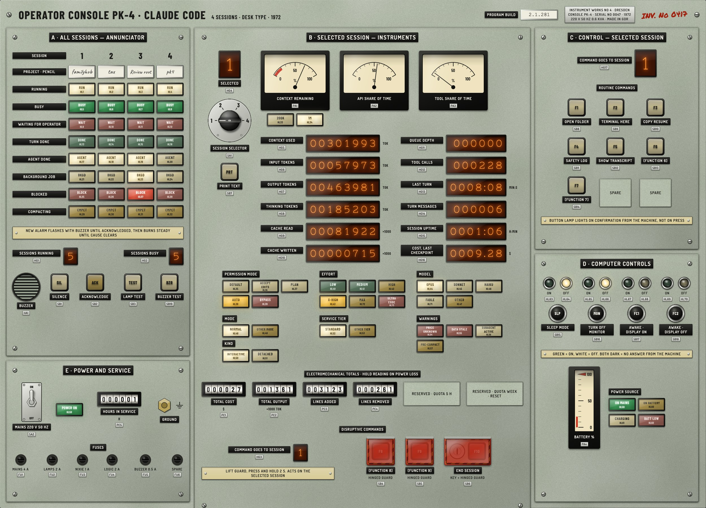

# SKALA-2000

**Operator Console for Claude Code, type DD-72.** A native macOS app that shows up to four
Claude Code sessions at once as a 1972 East German operator desk: lamp windows that flash
and burn steady, nixie tubes, drum counters, moving-coil meters, guarded buttons with a key,
a rotary selector, a MAINS switch and a buzzer.



It is a performance-first rebuild of the PK-4 console from Mac Command Center. The rules
and the readers of `~/.claude` come across unchanged, with their tests; the drawing is new.
The art is drawn once with Core Graphics off the main thread, and from then on Core
Animation only moves, swaps and fades layers. An idle desk costs 0.02% of a core, a live
resize 0.04 ms of main thread per frame. See [PERFORMANCE.md](PERFORMANCE.md).

## Running it

Requires macOS 14 or later. Built and measured on Apple silicon with macOS 26.

```bash
scripts/build-app.sh          # → build/SKALA-2000.app, ad hoc signed
open build/SKALA-2000.app
```

On first launch, if Mac Command Center's PK-4 desk has a memory, SKALA-2000 offers once to
carry on from it: drum totals, hours in service, pencil strips, selector, paint and buzzer
setting. Only that file is copied, never the logs.

The window is locked to the desk's proportions, at least 1280 points wide, and its home
is full screen on a display of its own. Closing it keeps the desk counting; ⌘Q quits.

### Hooks

Reading `~/.claude` tells the desk what is true: how full a context is, what a session
costs, whether it is busy. Only Claude Code's hooks say what just happened: a turn done, a
prompt waiting, a subagent finished. Install them from **Settings ▸ Claude Code hooks**, or:

```bash
scripts/install-claude-hooks.sh            # show what would change
scripts/install-claude-hooks.sh --install  # write it
scripts/install-claude-hooks.sh --remove   # take it back out
```

Twelve `async` hooks pipe their JSON to a Unix domain socket in
`~/Library/Application Support/SKALA-2000/`. Claude Code never waits for them, and a closed
app costs a session nothing. They are told apart by the socket path they name, so Mac
Command Center's hooks, and any you wrote yourself, stay where they are, and both apps can
listen at once. The settings file is copied to `settings.json.skala-backup` before every
write.

### Status line

Your plan's usage limits, the five-hour window and the week, reach a local program only
through Claude Code's status line. **Settings ▸ Claude Code status line** installs one: it
posts the status line's JSON to the same socket, and prints the line the app answers with,
for example `Opus 1M · ctx 37% · 5h 6% · week 72%`. Panel E shows both windows. They are
there on Pro and Max plans once a session has had its first answer, and update while a
session runs. A status line someone else configured is never replaced. Like any status
line, it makes Claude Code drop most of its footer's keyboard hints.

### Settings

Paint (grey-green, ivory, graphite), lamp designators, sound and volume, buzzer muted, the
scripted day (a demo in a data folder of its own), open at login, the hooks, the status
line, and the data folder. Day and night follow the Mac's Light and Dark appearance. Reduce Motion stops what
swings and slows the flash to 1 Hz; Increase Contrast darkens unlit glass.

## The desk

| Panel | What it shows |
| --- | --- |
| **A · All sessions** | Four session columns, nine lamp rows (RUN, BUSY, WAIT, DONE, AGENT, BKGD, BLOCK, CMPCT, LOW CTX under 5% of the context left), pencil strips for project names, sessions running and busy, the buzzer and its SILENCED lamp, SILENCE, ACKNOWLEDGE, LAMP TEST, BUZZER TEST |
| **B · Selected session** | The selector and SELECTED, context remaining, API and tool share of time (the needles drift a point or three now and then, as a moving coil does), token and cost nixies, permission mode, effort, model (Opus 200K and Opus 1M told apart by the session's context window), mode, kind, tier, warnings, drum totals, and the guarded F10–F12 (F12 ends the session after the key, a 2 s hold, and your password or Touch ID) |
| **C · Control** | F1 open folder, F2 Terminal here, F3 copy the resume command, F4 safety log, F5 show transcript; F6 to F9 have no job yet |
| **D · Computer controls** | Sleep, monitor off, Keep Awake with the display on (FC1) or off (FC2), battery, power source, and MAINS beside it |
| **E · Power and service** | Your plan's usage, the five-hour window and the week side by side, each on a horizontal edgewise meter red from 80%, with the time to its reset on nixies (hours and minutes for the session, days and hours for the week) and, under them, an amber NEAR LIMIT lamp from 80% and a red AT LIMIT from 95%, each beeping once as it comes on; hours in service |

A new alarm flashes until ACKNOWLEDGE turns it steady, and goes dark when its cause
clears. The buzzer speaks once as each state begins: one buzz for DONE, two quick for
WAIT, three quick for CMPCT, one long for BLOCK and the desk's own alarms (DATA STALE,
BATT LOW), and LOW CTX beeps, higher and rounder than the buzzer. SILENCE is a mode:
pressed, every signal is held back and its cap and the SILENCED lamp burn; pressed again,
the desk speaks again. Muting the buzzer in Settings does the same for good. A button's
lamp lights when the machine confirms, never on the press. A source that stops reporting
goes dark and raises DATA STALE.

## Privacy and security

- Session ids and pids are join keys: they go to the safety log and are never displayed.
- `ide.authToken`, `~/.claude/ide/*.lock`, `~/.claude/sessions/*.key` and job
  `providerEnv` are never opened, read, stored or logged.
- Prompt text reaches only the text log, and only on PRINT TEXT.
- The hook socket is mode 0600 and checks its peer's uid, requires an `X-SKALA-Client`
  header, refuses any request carrying `Origin`, and caps bodies at 8 MB.
- Nothing is sent anywhere. SKALA-2000 is not sandboxed, because it has to read
  `~/.claude`, and is distributed directly.

Files: the desk's memory, the safety log and the text log in
`~/Library/Application Support/SKALA-2000/`; the rendered art in
`~/Library/Caches/SKALA-2000/`.

## Development

```bash
swift test                                        # 249 tests, about 30 s
swift format lint --recursive --strict Sources Tests
scripts/build-app.sh && scripts/bench.sh static   # CPU and memory in one scenario
```

| Module | What it is |
| --- | --- |
| `TelemetryKit`, `ConsoleKit`, `ConsoleRuntime`, `FakeSources` | Copied from Mac Command Center with their tests: the readers of `~/.claude` and the Mac, the console's rules, its files and commands, the scripted day |
| `DeskArt` | Tokens, fonts, the layout table and the Core Graphics painters; `ArtSet` renders everything for one style at one pixel size into IOSurfaces, in parallel, and caches it on disk |
| `DeskView` | The layer-hosting view: snapshot to layers, animations, the hit table, keyboard, VoiceOver |
| `DeskSound` | The relays, the buzzer, and the director that plays them from snapshots |
| `HookServer` | The hook socket and the installer |
| `KeepAwake` | FC1 and FC2 as IOKit power assertions |
| `SKALA2000App` | The app: window, menus, Settings, wiring |
| `DeskReference` | Development only, never shipped: a tagged copy of the reference SwiftUI desk |

The layout is measured, not placed by eye. `swift run DeskReference layout` renders the
reference desk and writes every primitive's frame to `docs/layout.json` and
`Sources/DeskArt/Generated/LayoutData.swift`. `swift run DeskReference test-goldens`
writes the golden renders the tests compare the real layer tree against, and `compare`,
`live`, `probe` and `timing` measure the painters. See the handover in
[docs/HANDOVER.md](docs/HANDOVER.md) and the design system in
[docs/design-system/](docs/design-system/).

## Licence

MIT; see [LICENSE](LICENSE). The five typefaces in `Resources/Fonts/PK4/` are under the SIL
Open Font License or the Apache License, with their licences beside them.
